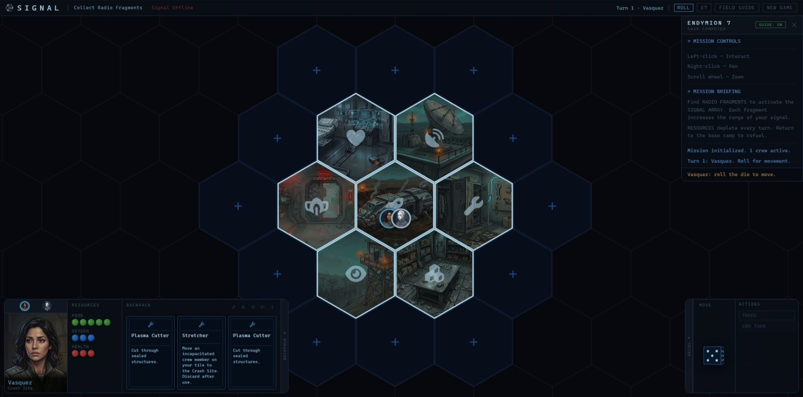

# SIGNAL

*A game of survival, exploration, and eroding trust — where rescue is uncertain, and the greatest threat may be sitting across the table.*

**1–6 Players · Ages 14+ · 30–60 Minutes**

---

# The Story

You are the crew of the Endymion 7, a deep-range mining vessel. Your ship has crash-landed on an uncharted alien planet. You don't know what brought you down. You don't know what's out there. You have what survived the crash, and each other — for now.

Somewhere out there, scattered across the terrain, are pieces of your radio. Find them and rebuild the Signal Array. Rescue is possible but not guaranteed. And the longer you're stranded, the more the planet changes you.

---

# How to Play

Signal is a survival game. All players begin at a crashed ship with nothing but a handful of equipment and a dwindling supply of food and oxygen. The planet around you is unmapped — you reveal it as you explore, placing tiles as you go.

Your goal is to locate Radio Fragments scattered across the terrain, return them to the ship's Signal Array, and activate a rescue beacon strong enough to be heard. Rescue arrives when the Signal Roll succeeds. Anyone alive at that moment wins.

But survival is not just about resources and navigation. The planet corrupts. Some players may find themselves — quietly, privately — working against the group.

The game has no fixed end point. You don't know when rescue will come. You don't know who, if anyone, has been corrupted. You only know what you can see, what you've been told, and how much you have left.

## The Three Tensions

- **Survival.** Rations and O2 Tanks deplete every round. The crash site is your lifeline. Venture too far and you may not make it back.
- **Exploration.** Radio Fragments are out there, but finding them means pushing deeper into unknown terrain — away from safety, away from others, into situations only you will know about.
- **Trust.** Corruption changes a player's win condition silently. The group must cooperate to survive, but cooperation requires trust the planet is quietly eroding.

Signal is designed to teach itself with instructions revealed through gameplay. The only things players need to know before their first turn:

- Roll to move.
- Draw and place tiles when you reach unexplored space.
- Investigate and draw an Event card.
- Flip your resources when your turn ends.
- Survive until rescue.

---

# Field Guide

- View the [Field Guide](docs/FieldGuide.md) which fully explains all the rules and gameplay.